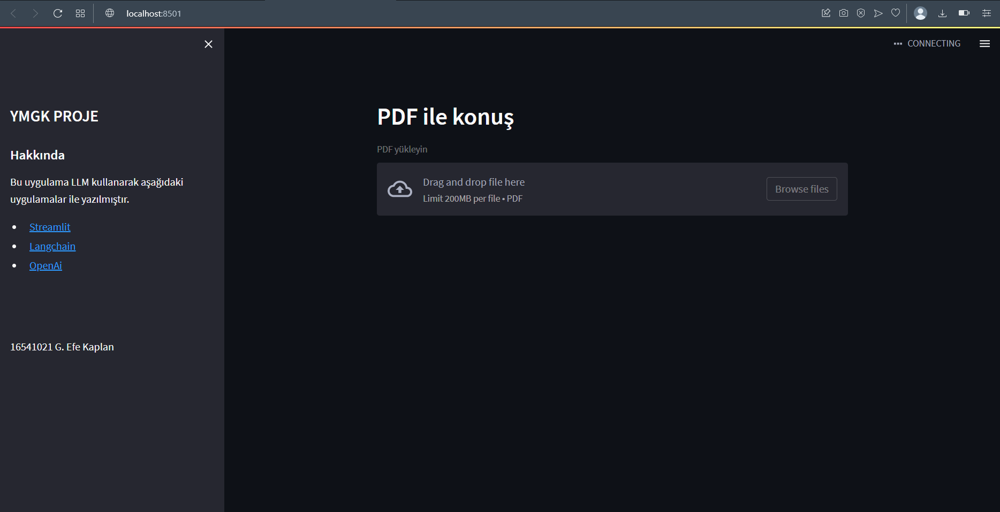
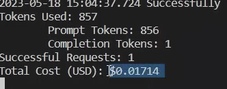
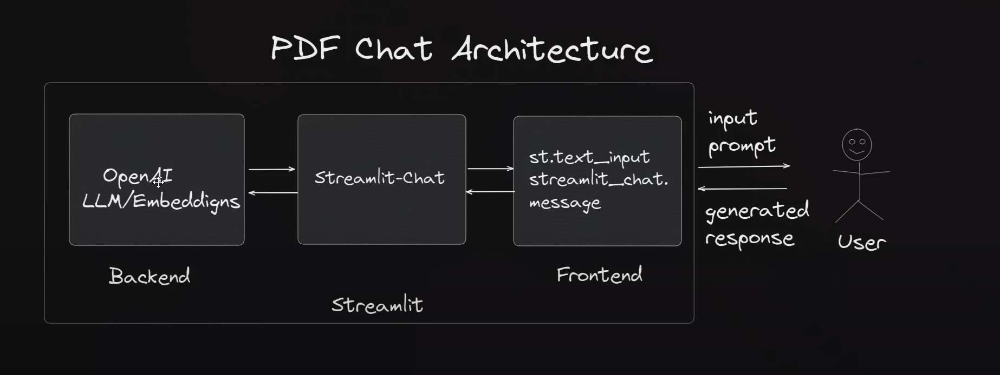
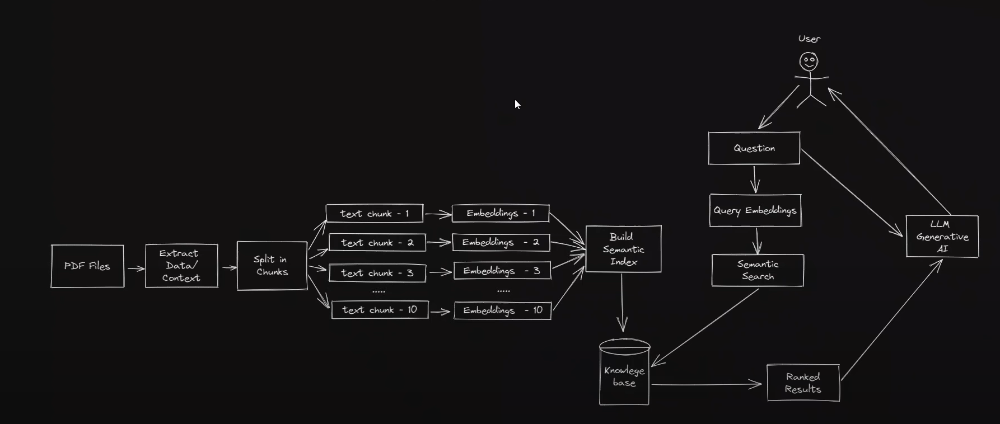

#16541021 G. Efe Kaplan

# Amaç

Bu projede amaçlanan istediğiniz bir pdf'i yükleyip daha sonrasında o belgeye ChatGPT-4'ü kullanarak sorular sorabilmenizi mümkün kılmaktır.

## Çalıştırmak için

Öncelikle repoyu clone'layınız.
“`
git clone https://github.com/nekodu/YMGK-PDF.git
“`

Daha sonrasında requirement.txt dosyasını çalıştırınız. Bunu yapmak için klonladığınız dosyanın içine girip alttaki kodu yazmanız gereklidir.

“`
pip install -r requirements.txt
“`

### OPEN_API_KEY
.env dosyasında girmeniz gereken bir api anahtarı mevcuttur. OpenAI sitesine girip kayıt olup api anahtarı edininiz. Dolar üzerinden hesaplandığı ve Gpt4 görece pahalı olduğu için malesef sizinle anahtarımı paylaşamıyorum. Tek yapmanız gereken OPEN_API_KEY = ..... kısmına api anahtarınızı kopyalamanızdır.

### Uygulama Nasıl Çalışıyor?

